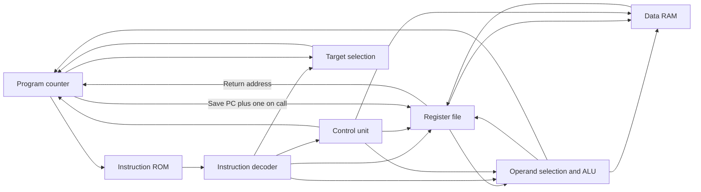

# 16-bit CPU in Logisim Evolution

A 16-bit CPU built in Logisim Evolution to explore instruction execution and datapath design. It originated in a two-person computer architecture assignment. The project connects a custom instruction set to a program counter, register file, ALU, instruction decoder and control unit. Separate instruction ROM and data RAM hold programs and data, while a return-address register supports calls and returns.

The repository includes the circuit and four demonstration programs covering loops, immediate logic, register operations, memory access and control flow. Memory images can be loaded directly into Logisim; a Python converter and optional Java trace utility support inspection. The design is unpipelined and intended for studying instruction execution. Original manual observations and later automated traces differ, as described separately below.
## Features

- 16-bit instructions and data, with eight writable general-purpose registers.
- A separate return-address register for calls and returns.
- Arithmetic, bitwise logic, memory access, and control-flow instructions.
- Four demonstration programs with machine-code words and Logisim memory images.
- A Python memory-image converter and an optional Java trace utility.

## Architecture



| Circuit | Role |
| --- | --- |
| `CPU` | Top-level datapath, ROM and RAM |
| `PC` | Instruction sequencing, branch/jump selection and halt gating |
| `REG_file` | Two read ports, general-register writeback and return address |
| `ALU` | Addition, AND, OR, pass-through and signed comparison |
| `op_decode` / `CU` | Instruction fields and control signals |

Both memories have 16-bit addresses and 16-bit words. The design has no pipeline or call stack. [Architecture notes](docs/architecture.md) describe the wiring and timing in more detail.

The opcode space contains `li`, `addi`, `andi`, `ori`, `add`, `and`, `or`, `move`, `load`, `store`, `ble`, `bne`, `jump`, `call`, `rtn`, and `halt`. The [instruction-set notes](docs/isa.md) explain encoding, intended meanings and later trace observations. Assembly files are reconstructed annotations; no assembler is supplied.

## Demonstration programs

| Program | Main operations |
| --- | --- |
| [1](examples/program1/program.asm) | Incrementing and a conditional loop |
| [2](examples/program2/program.asm) | Immediate AND and OR |
| [3](examples/program3/program.asm) | Register logic, stores and a load |
| [4](examples/program4/program.asm) | Calls, returns, moves and a jump |

Four demonstration programs were used during the original coursework. A later automated simulation produced results that differed from the original manual observations. This discrepancy remains unresolved.

The student reports successful original manual runs; those GUI observations have not been independently reproduced in this review. The [trace report](docs/verification.md) retains the later measurements and possible explanations.

## Getting started

Use [Logisim Evolution 3.9.0](https://github.com/logisim-evolution/logisim-evolution/releases/tag/v3.9.0), the version recorded in the circuit. Its JAR requires Java 21 or newer; the earlier trace checks used JDK 24.0.2.

1. Open `cpu/simple_16bit_cpu.circ` and select the main `CPU` circuit. Its embedded ROM initially contains program 4.
2. Pause the clock. Use the ROM memory editor/context action at `(870,190)` to load an example's `memory_image.txt`. The adjacent RAM holds data. Command-line `--load` loads RAM and is not the program-loading procedure for this circuit.
3. Set the top-level `reset` input high, allow propagation, then set it low. Reset clears PC and registers, but not RAM; use a fresh simulation state for independent runs.
4. Step the clock at `(260,490)` through low/high phases, allowing propagation. PC, register writes and RAM writes use rising edges.
5. Inspect PC, the eight general registers inside `REG_file`, the separate return-address register, and RAM locations 0 and 1. If an address becomes unknown, stop and compare the state with the trace report.

Screenshots are not included. [GUI observation notes](docs/screenshots.md) describe useful views for a manual comparison.

The supplied memory images use Logisim's `v2.0 raw` text format. To generate the optional original-style byte stream:

```bash
python scripts/generate_memory.py --input examples/program1/machine_code.txt --output examples/program1/memory.bin
```

Add `--format logisim` for text-image output. Binary output contains two bytes per word, most significant byte first, without a Logisim text header.

## Testing

From the repository root, with Python 3.10 or newer:

```bash
python -m unittest discover -s tests -v
```

The tests check memory conversion, example encodings, byte order and invalid inputs. They do not establish full CPU correctness. Recorded simulator traces and their reproduction commands are in [docs/verification.md](docs/verification.md); those traces were not rerun during this documentation cleanup.

## Contributions

This was a two-person coursework project. My primary responsibilities were the Program Counter, Register File, datapath integration, debugging, and the four machine-code test programs and memory images. My teammate primarily implemented the ALU, Control Unit and instruction decoder, and prepared the coursework answer sheet.

This division of responsibilities is recorded in the supplied coursework materials; file contents alone do not independently establish authorship. Documentation, conversion refactoring and trace tooling were added later.

## Limitations and background

The CPU is an unpipelined educational design with one return-address register and no demonstrated nested-call support. Automated trace findings and original manual observations still need reconciliation; no exhaustive ISA or performance claim is made. The circuit, embedded ROM, original test words and trace outputs are preserved.

[Source notes](docs/file-selection.md) record the coursework file mapping. No project-wide license is supplied; licensing the joint work requires the contributors' authorization.
